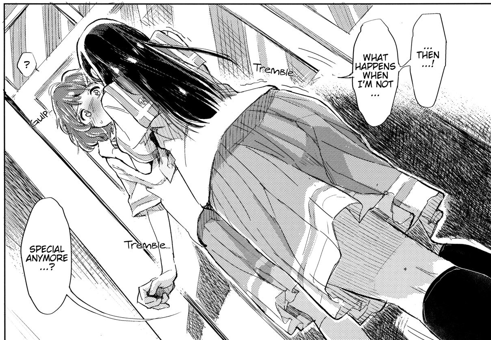

"There is no such thing as that rose-colored campus life. Why? Because there is nothing rose-colored in this world. Everything is all a bunch of colors mixed up, you see." -- The Tatami Galaxy.

The first months of my high school years were absolutely catastrophic, largely because middle-school me was a naive moron who actually dreamt of this sparkling, "rose-colored" life where I would be doing something meaningful, something creative, rather than just training to be another rust-covered cog in the societal machine. Stupid middle-school me didn't realize that high school is just a loading screen that never ends. It was the same studying, the same rote memorization, the same monotony over and over. Worse than the most mundane, mediocre video game loop that I was forced to grind again and again and again.

Eventually, I just snapped. "Just jinx it all now and let's do something fun," I thought, and so I picked up programming. I didn't start with great hope- just simply out of sheer, desperate curiosity. But little did I know, that random curiosity would mutate into a hobby, then a life-long profession; and along the way, it brought me into that exact rose-colored life I had hallucinated about so dearly. A life so grand and pretty that I don't think even the characters in the most happy-go-lucky animes could compare to what I was living.

Until now, and maybe forever, I still hold great pride that I did not cheat my glory into existence. I silently worked for years---grinding away before and after I picked up the code---with little recognition, purely to improve my craft and slowly but surely earn a reputation like real adult men. No one who persistently pursues such a deed does so solely out of a desire for blind self-satisfaction. They do it to reach others and to show themselves. I was and am no exception. When Kither, Newplayers12, Toha, and my friends, my teachers eventually *saw* me, cared for me, treated me the way they did, I knew the rose-colored life of my dream had come true. I've fallen in love with these people, and I've grown addicted to the warmth they make me feel.

But if you think this is going to be some sappy, ooey-gooey victory lap where I yap about how happy I am, then, surprise surprise, **no**. This is my acknowledgement that the life I was so proud of has now all crashed and fucking burned. And I have no one else to blame but myself.

I parted ways with Kither somewhere around the 22nd or 24th of December, 2021. Not that we were attached at the hip to begin with, but he was my role model, my compass that guided me toward some semblance of a "best self." Losing track of him was the undisputed catalyst for the downfall that followed.

We went to different universities, and approached our life differently. He was this keen, visionary, passionate intellect who could always find his way to dominate any field that sparked his interest. I, on the other hand, was merely a tourist. An adventurous fraud seeking only thrill and "experience" to fill the void, exactly like the dumb, naive middle-schooler I claimed to have outgrown. Naturally, I deemed that no such thrill would be equal to landing a computer science job right on my freshman year. And because the universe loves a bad joke, I landed it.

But as I settled into this so-called "adult life," the long-smoldering flaws in my foundation started to crack wide open. It dawned on me: What becomes of me when the "fun" evaporates? When I have no one I want to reach out to and nothing I want to show anyone? My sense of direction had completely vanished. My first year of work and university was merely a performance, a hollow charade to deceive not only my peers but my own miserable self into believing I was special, that I was the protagonist of this story. By the second year, when bits of the delusion started to wear off, I tried to steer the ship around; but guess what happens when an egoistic, delusional, pretentious brat tries to convince the world he's a responsible, capable man? That's right, he's going to spiral downward with terminal velocity. The harder I tried to improve myself, the more disillusioned I became. One and two and three and four and five and six times I took a leap- working on a torturous schedule, wasting God knows how much time and energy- and every single time it ended in the most embarrassing, lamentable failure imaginable. I thought I had hit rock bottom.

But hey, I still had two years to fix it, right? I had learned my lesson, right? Well, seeing as I'm here writing these stupid, pathetic lines, the answer should be painfully obvious: Not only did I fail to get better, but I somehow managed to grabbed a shovel and started digging for hell. And the worst part? The joke of it all? All gods above and below actually tried to save me, I was just too far beyond help.

Right when I was at my most vulnerable, Kither reappeared like some Deus Ex Machina and offered me a hand. He invited me to a contest, slotting me into a team of absolute GOATs. He carried my dead weight all the way to the final round of SOICT, where we even got the chance to travel together and get along and do shit. This could have been a perfect chance for me to make a leap of faith, could have been my "character arc," but what it was... was the complete opposite. I disappointed **everyone**. For years I couldn't express my gratitude to Kither and Toha, and when I finally had the chance to, I just jinxed everything. I offered nothing but being a rusty, decrepit motherfucker.

Then came my second chance: Kither invited me to TTHCMUS where we got to compete with my utmost strength---general information technology and computer science knowledge. We fought bravely and got to semi-finals, but guess what? **IT WAS ME WHO JINXED EVERYTHING AGAIN!** I somehow submitted a dynamic-linking program to the static-only judge machine---a mistake only the worst, most brain-rotted Linux devs would fall for---and incinerated all the fruits of our training. Then came even my third chance: Kither invited me to Viettel AI Race, which was perfectly fitting for my major. And unsurprisingly, I disappointed them **AGAIN**. This time, no finals, no semi-finals, only my absolute, utter powerlessness to do anything for the people I love.

So... is this it?

Looking back, for six years I've been making and maintaining relationships purely by being "special." I have no other notable skills. I can't even hold a basic conversation without alcohol or layers of irony. But unlike Kousaka Reina or Oumae Kumiko, whose desire to be special drove their maturity, my desire to be special was just a toxic, egoistic parasite. I will never be Kither's first choice again. The friends and people who once looked up to me, who I could help, who I could inspire,... they have all surpassed me and won't need me anymore. I'm not special anymore. What happens to me if I'm not special anymore? I don't really know the answer to that, but when you're at the point where you're asking yourself questions such as these, what you're really asking is, fundamentally: What is the point of trying to be special in the first place? Why bother building a "rose-colored life" while I can't even play a part of it? Why did I bother chasing the sun when I knew my wings were made of wax? When will I finally have the courage to stop the charade, to stop pretending just so I can stop doing the one thing I do best: Failing the people who dared to believe in me?

In the end, reaching my goals, distracting my feelings changed nothing at all. It was just more thrills to fill the void, leaving me as the same insatiable, hollow shell.

"If you've got a problem with the world, change yourself. If that's a problem, close your eyes, shut your mouth, and live like a hermit." -- Motoko Kusanagi. In the end, I am powerless to change anything. Soon, somewhere late 2026 or 2027, my time will run out and my curtain will fall. The people who once loved me, and whom I love dearly, will learn what I truly am. What becomes of me then? Perhaps I'll just be another ghost in the shell, a peak-in-high-school kid haunting his own memories. Or a hermit, finally quiet, finally still. Finally done disappointing the world.

