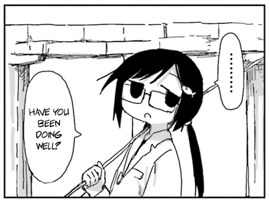
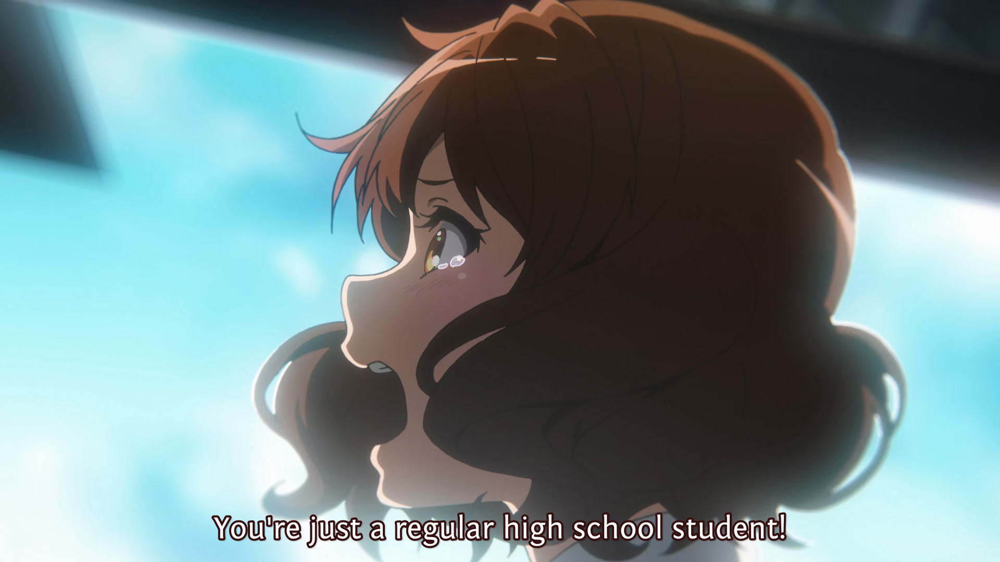

For those of you who never knew, "iluvgirlswithglasses" was a reference to Konata Izumi. She was the protagonist of a show named Lucky Star---which I absolutely wouldn't recommend to you or a single living soul I know, unless you've been so thoroughly overexposed to pop culture around that era that you'd actually take a liking to a show made entirely of meta-reference schlock. Konata was this lazy but smart high school otaku. She lived a carefree life, loved cutting corners and exploiting shortcuts, and dedicated the vast majority of her time and energy to eccentric---and conventionally looked-down-upon---hobbies (if you're too young, then may I remind you how looked-down otakus are in 2007). Yet, when the moment called, she could effortlessly show off some pure, unadulterated talent, completely sweep her academics, and even randomly flex some athletic prowess. In one totally mundane, random moment, a friend complained to her about receiving junk mail lately. Konata simply suggested she use an email address that's hard to guess, like her own: "meganekkogekirabu"---which roughly translates to "I love girls with glasses".

My "iluvgirlswithglasses" was a reference to that kind of person; or rather, attitude. That _"Just jinx it all now and let's do something fun"_ mindset I wrote about in [the first dont-read-me](./dont-read-me.md) was completely inspired by this perception of "iluvgirlswithglasses". But obviously, a _relatively healthy_ guy (maybe) like me changes a hell lot between the ages of 15 and 22. By now, neither does my teenage perception of Konata hold up like it did when I was 15, nor can I genuinely delude myself into thinking I'm some sort of natural-born genius who can effortlessly cheat his way to success anymore. Even so, I still harbor this deep-seated preference for using fictional icons to represent myself, even if I know that representation won't hold true tomorrow. Because as long as it accurately reflects who I was during a specific, fleeting fraction of my life, then it's more than enough.

We, due to the limitations of our human brain, need these reflections to understand ourselves and to scrape some semblance of a lesson from our past. Memories are fragile things and it is well-proven that our stupid brain fabricates far too many details. And if you write your history down in a diary or something, it wouldn't work either: listing event by event, detail by agonizing detail, all under YOUR perspective and YOUR present, subjective emotions... soon enough that diary is going to devolve into a pathetic junk mess, and the next time you crack it open, best you can do is just laugh at how silly things were and how abysmally bad you write, and you'll never learn a damn thing from it. Have you ever heard anyone genuinely claim to have learned a lesson from reading their teenage diary? Absolutely not. What kind of question is that?. You see how obvious my point here is?. That is exactly why I always seek myself---my own ontological reflection---within something else. A book, an anime, a movie, a video game... you name it. I will forever keep the name "iluvgirlswithglasses" because I desperately never want to forget that fundamental desire to be free. I will always rewatch Hibike Euphonium every single year (it's been a habit) because every time I do, I learn more about things I either missed out on---or miraculously possessed---during my own high school life. I will always maintain that tkmiz-worshipping GitHub profile page of mine simply because of how much of a cynical existentialist he (and Ernest Hemingway) molded me to be. Reflections are uniquely special; at different junctures in my life, I can only look at them from new, alienating angles whether I want to or not, and that slowly pieces together a marginally more complete picture of me.

Thus, it would probably take me decades more to finally, comprehensively articulate exactly how much Hibike Euphonium, tkmiz, and Ernest Hemingway have impacted my life. It's not like I haven't tried before (I admit I've tried at least trice for Hibike Euphonium and tkmiz), but every goddamn time I revisit them, I uncover some new layer about their works, and consequently, about my own pathetic self. Consequently, I can never put my pen down to write a definitive edition. I'm still changing over time, that's obvious. I'm only 22. I fully expect even more violent, dramatic changes over the next 5 to 10 years. So... I'll just leave those masterpieces on the shelf for a later date. But today, and today only, I feel like I have something I can confidently express in full: _Umamusume Pretty Derby Season 2_.

Let's be incredibly clear: Umamusume Season 2 is not a definitive masterpiece like Hibike Euphonium or the works of tkmiz and Hemingway. For the latter, I would gladly defend them with my life. Anime fans or non-anime fans, critical thinkers or mindless no-brainers, film elitists or TikTok kids... it genuinely doesn't matter; I don't care how blind people seriously have to be, as long as they possess a human soul they will eventually appreciate THESE pure brilliances being presented before them, just like how everyone will celebrate a sunset or sunrise as long as they actually put their mind to it. But for Umamusume SS2? I absolutely do not have that kind of arrogant confidence. It simply "stings" at this incredibly specific stage of my life; it came to me serendipitously right in the very most final hours of my long four years of downfall before I finally picked myself up. It feels like this anime was made for ME, personally and directly.

So, while I'm still slowly gathering the life experience required to collect my thoughts on the other works... let me just spill my guts about Umamusume.

> _continue in [the second dont-read-me, second half](./dont-read-me_2b.md)_

